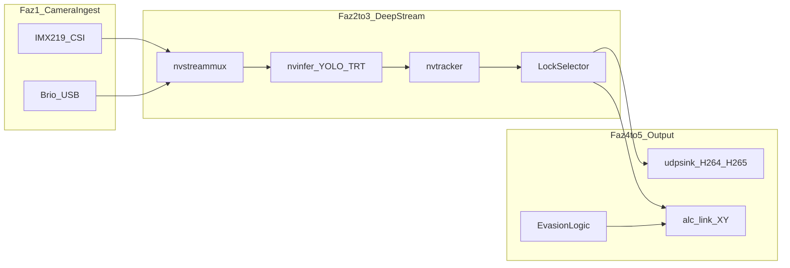

# TEKNOFEST Savaşan İHA — DeepStream Görüntü ve Kilitlenme Yol Haritası

> **Tarihsel plan belgesi.** Bu yol haritasındaki `01_Prototip_Python/` referansları artık
> geçersizdir — Python prototip dizini workspace'ten kaldırılmıştır; üretim hattı tek başına
> `02_Ana_Sistem_CPP/` (C++). Güncel mimari için `README.md` ve `AGENTS.md`'ye bakın.

Bu belge, **Jetson Orin NX** üzerinde NVIDIA **DeepStream** ile görüntü işleme, düşman İHA tespiti, **nvtracker** ile kilitlenme, **UDP** ile düşük gecikmeli video aktarımı, **Alacakart** otopilot iletişimi (**alc_link**) ve **kaçış** mantığını kapsar.

Proje dizin yapısı ve operasyonel kurallar [.cursorrules](.cursorrules) içindedir. Donanım/yazılım sürümleri ve yollar [JETSON_ORIN_NX_MANIFESTO.md](JETSON_ORIN_NX_MANIFESTO.md) envanteri ile hizalanmalıdır.

---

## Kapsam ve kapsam dışı

**Bu belgenin kapsamı**

- Görüntü alma (CSI + USB), GPU ivmeli inference (**nvinfer** + TensorRT), takip (**nvtracker**), kilit hedef seçimi
- H.264/H.265 **UDP** (RTP) ile yer istasyonuna video akışı; gerekirse ayrı hafif telemetry kanalı
- Kilit koordinatlarının (X, Y) **alc_link** ile Alacakart’a iletilmesi
- Kaçış algoritması (kural veya görüntü tetikli; otopilota komut üretimi)

**Kapsam dışı (bu planda detaylandırılmaz)**

- Yer istasyonu arayüzü (GUI)
- YOLO modelinin eğitilmesi

Hazır TensorRT motoru (`.engine`) ve sınıf etiketleri (`labels.txt`) varsayılan olarak [`03_Modeller/`](03_Modeller/) altında tutulur; `nvinfer` yapılandırması bu yollara veya ortam değişkenlerine referans verir.

---

## Zorunlu kurallar (`.cursorrules` / kırmızı çizgiler özeti)

1. **CPU inference yok:** YOLO ve benzeri ağlar yalnızca TensorRT (`.engine`) veya GPU üzerinde çalıştırılır.
2. **Kamera:** `cv2.VideoCapture(0)` kullanılmaz; GStreamer ile donanım hızlandırmalı hatlar (CSI için `nvarguscamerasrc`; USB için uygun kaynak + `nvv4l2decoder` vb.) kullanılır.
3. **OpenCV:** `pip install opencv-python` kullanılmaz; özel derleme `/usr/local/opencv4` yolu ile bağlanır.
4. **Derleme:** CMake ve C++ tarafında include/lib için `/usr/local/opencv4` ve `/usr/local/cuda-12.6` açıkça kullanılır.
5. **Performans:** CPU–GPU arasında gereksiz kopya yapılmaz; mümkün olduğunca NVMM ve DeepStream eklentileri kullanılır.

---

## Hedefler (özet)

- Düşman İHA tespiti (**nvinfer**), sürekli kimlik ile kilitlenme (**nvtracker** + hedef seçici)
- Ubiquiti **Rocket AC Lite** → **LiteBeam 5AC** hattında düşük gecikmeli H.264/H.265 aktarım
- Kilit (X, Y) bilgisinin C++ üzerinden **alc_link** ile Alacakart’a iletilmesi
- Kaçış davranışının tanımlanması ve otopilota uygun komutların üretilmesi
- **IMX219 (CSI)** ve **Logitech Brio 4K (USB)** için ayrı pipeline şablonları; fazlarda önce tek aktif kaynak, ileride `nvstreammux` ile birleştirme

---

## Yüksek seviye veri akışı

Kamera NVMM akışı `nvstreammux` ile birleştirilir (çoklu kaynak aşamasında), ardından **nvinfer** (YOLO-TRT) ve **nvtracker** çalışır. Kilit seçici, seçilen hedefe göre hem video encode + **UDP** hattını hem de **alc_link** (X,Y) çıktısını besler. Kaçış mantığı, kilit durumuna veya harici sinyallere göre **alc_link** (veya ayrı komut kanalı) üzerinden davranış değiştirir.

---

## Faz 1 — Kamera ingestion

**CSI (IMX219)**

- Önerilen zincir: `nvarguscamerasrc` → `nvvidconv` → NVMM uyumlu caps.
- Çözünürlük ve FPS, Jetson yükü ve yarışma gereksinimine göre sabit profiller (ör. 1280×720 @ 30/60) olarak `ingest_config` içinde tanımlanır.

**USB (Logitech Brio)**

- `v4l2src` (veya uygun kaynak) + formata göre `nvv4l2decoder` (MJPEG/H.264 vb.).
- Brio’nun V4L2 modları cihaza göre değişebilir; pipeline alt string’leri konfigürasyondan parametreleştirilir.

**Çıktı**

- DeepStream girişi için ortak format (ör. NV12); `nvstreammux` ile uyumlu caps.

**Python** — [`01_Prototip_Python/`](01_Prototip_Python/)

| Dosya | Amaç |
|--------|------|
| `gstreamer_csi_imx219.py` | CSI pipeline duman testi (gecikme, FPS) |
| `gstreamer_usb_brio.py` | USB pipeline duman testi; Brio mod notları |

**C++** — [`02_Ana_Sistem_CPP/`](02_Ana_Sistem_CPP/)

| Dosya | Amaç |
|--------|------|
| `src/camera/csi_source.hpp`, `csi_source.cpp` | Argus tabanlı CSI kaynak fabrikası |
| `src/camera/usb_source.hpp`, `usb_source.cpp` | V4L2/USB kaynak fabrikası |
| `src/pipeline/ingest_config.hpp` | Çözünürlük, device path, aktif kamera seçimi (enum) |

**Config (isteğe bağlı):** `02_Ana_Sistem_CPP/config/cameras.yaml` — profilleri YAML ile dışarı almak.

---

## Faz 2 — DeepStream inference (nvinfer)

- Hazır TensorRT motoru: `nvinfer` primary GIE için `config_infer_primary.txt` (YOLO varyantına özel örnekler DeepStream dokümantasyonundan uyarlanır).
- ONNX → engine dönüşümü yalnızca referans; eğitim bu planda yok. Mevcut [`01_Prototip_Python/tensorrt_conversion.py`](01_Prototip_Python/tensorrt_conversion.py) bu amaçla genişletilebilir veya ayrı bir araçla değiştirilir.
- **Python doğrulama:** NVIDIA DeepStream Python örnekleri ve `pyds` ile probe üzerinde bbox/metadata kontrolü.

**Python**

| Dosya | Amaç |
|--------|------|
| `deepstream_probe_metadata.py` | `pyds` ile metadata doğrulama (DeepStream Python bağımlılığı notu ile) |

**C++**

| Dosya | Amaç |
|--------|------|
| `src/deepstream/ds_app.hpp`, `ds_app.cpp` | `GstPipeline`, `nvinfer`, primary config yolu |
| `config/deepstream/config_infer_primary.txt` | Model yolu (`03_Modeller/` veya env) |
| `config/deepstream/labels.txt` | Sınıf isimleri (düşman İHA sınıfı net etiketlenir) |

---

## Faz 3 — NvTracker ile kilitlenme

- `nvtracker` + `tracker_config.yml`. JetPack / DeepStream sürümüne göre **NvDCF**, **IOU** vb. seçeneklerden biri seçilir; üretim öncesi saha verisiyle kararlaştırılır.
- **Kilit politikası örnekleri:** en yüksek güven skoru; görüntü merkezine en yakın bbox; minimum alan eşiği; track ID stabilitesi ve kayıp track için timeout.

**Python**

| Dosya | Amaç |
|--------|------|
| `tracker_lock_logic_proto.py` | bbox + `track_id` ile kilit mantığının saf Python simülasyonu / birim test mantığı |

**C++**

| Dosya | Amaç |
|--------|------|
| `src/tracking/track_selector.hpp`, `track_selector.cpp` | `NvDsObjectMeta` / `NvDsFrameMeta` üzerinden hedef seçimi |
| `src/tracking/lock_state.hpp` | Kilit durumu, kayıp track zaman aşımı |
| `config/deepstream/tracker_config.yml` | Tracker parametreleri |

---

## Faz 4 — UDP görüntü ve veri aktarımı

- Görüntü hattı: ihtiyaca göre `nvosd` veya dönüşüm elemanları; encode: `nvv4l2h264enc` / `nvv4l2h265enc` (JetPack sürümüne uygun nvenc bileşenleri); `rtph264pay` / `rtph265pay`; `udpsink` — düşük gecikme için `sync=false`, `async=false`, buffer ayarları.
- **Video RTP** ile **metadata** (bbox, track id, kilit durumu) ayrı kanallarda düşünülür: ince telemetry için ikinci bir UDP soketi veya mevcut takım protokolü.

**Python**

| Dosya | Amaç |
|--------|------|
| `gstreamer_udp_tx_test.py` | Uçtan uca düşük gecikme parametreleri ile test |

**C++**

| Dosya | Amaç |
|--------|------|
| `src/telemetry/video_udp_tx.hpp`, `video_udp_tx.cpp` | Encode + RTP + hedef IP/port |

**Not:** Ubiquiti kablosuz hattında jitter ve MTU; I-frame aralığı ve bitrate, kopmada toparlanma süresini etkiler.

**Config:** `02_Ana_Sistem_CPP/config/udp_tx.yaml` veya `udp_tx.ini` — hedef adres, port, codec seçimi.

---

## Faz 5 — Alacakart entegrasyonu (`alc_link`) ve kaçış

**Otopilot arayüz sözleşmesi (takımla netleştirilecek)**

- Kilit (X, Y): normalize [0,1] veya piksel koordinatı; eksen yönü ve görüntü boyutu ile birlikte dokümante edilir.
- Gönderim frekansı, timeout ve “kilit yok” durumu aynı sözleşmede tanımlanır.

**C++**

| Dosya | Amaç |
|--------|------|
| `src/autopilot/alc_link_bridge.hpp`, `alc_link_bridge.cpp` | `alc_link` ile non-blocking veya thread-safe (X,Y) gönderimi |
| `src/evasion/evasion_controller.hpp`, `evasion_controller.cpp` | Kural veya görüntü tetikli kaçış (ör. kilit kaybı, tehdit yakınlığı); çıktı `alc_link` veya ayrı komut kanalı |

**Python**

| Dosya | Amaç |
|--------|------|
| `evasion_logic_proto.py` | Kaçış durum makinesi prototipi; C++ ile aynı semantik hedeflenir |

**İsteğe bağlı:** `02_Ana_Sistem_CPP/docs/autopilot_protocol.md` — yalnızca mesaj formatı ve zamanlama notları (GUI içermez).

---

## Ana giriş ve derleme

- [`02_Ana_Sistem_CPP/src/main.cpp`](02_Ana_Sistem_CPP/src/main.cpp): Fazlara göre modüler başlatma veya çalışma modları (ingest-only, infer+track, full pipeline).
- [`02_Ana_Sistem_CPP/CMakeLists.txt`](02_Ana_Sistem_CPP/CMakeLists.txt): GStreamer, DeepStream (`/opt/nvidia/deepstream/deepstream`), OpenCV (`/usr/local/opencv4`), CUDA 12.6 (`/usr/local/cuda-12.6`) include ve kütüphaneleri.

---

## Önerilen dosya özeti (tablo)

| Faz | Python (`01_Prototip_Python/`) | C++ (`02_Ana_Sistem_CPP/`) | Config |
|-----|-------------------------------|----------------------------|--------|
| 1 | `gstreamer_csi_imx219.py`, `gstreamer_usb_brio.py` | `src/camera/csi_source.*`, `src/camera/usb_source.*`, `src/pipeline/ingest_config.hpp` | Opsiyonel `config/cameras.yaml` |
| 2 | `deepstream_probe_metadata.py` | `src/deepstream/ds_app.*` | `config/deepstream/config_infer_primary.txt`, `labels.txt` |
| 3 | `tracker_lock_logic_proto.py` | `src/tracking/track_selector.*`, `src/tracking/lock_state.hpp` | `config/deepstream/tracker_config.yml` |
| 4 | `gstreamer_udp_tx_test.py` | `src/telemetry/video_udp_tx.*` | `udp_tx.yaml` veya `udp_tx.ini` |
| 5 | `evasion_logic_proto.py` | `src/autopilot/alc_link_bridge.*`, `src/evasion/evasion_controller.*` | Opsiyonel `docs/autopilot_protocol.md` |

**Mevcut placeholder dosyalar:** [`01_Prototip_Python/gstreamer_test.py`](01_Prototip_Python/gstreamer_test.py) ve [`tensorrt_conversion.py`](01_Prototip_Python/tensorrt_conversion.py) yukarıdaki yeni dosyalarla birleştirilebilir veya ayrı tutulup aşamalı olarak doldurulabilir.

---

## Doğrulama checklist

- Uçtan uca gecikme: kamera → UDP alıcı (yerde test PC veya `gst-launch` ile)
- FPS, GPU/CPU kullanımı, termal davranış (uzun süreli koşu)
- Track ID drift ve hedef değişiminde kilit geçişi
- Kablosuz link kopması / yeniden bağlanma sonrası akış
- `alc_link` heartbeat ve “kilit yok” güvenli durumu

---

## Riskler ve bağımlılıklar

- Brio’nun V4L2 çözünürlük ve codec varyantları ortamdan ortama farklılık gösterebilir.
- DeepStream / JetPack sürümü ile `tracker_config.yml` ve özel parser uyumu doğrulanmalıdır.
- Çoklu kamera aynı anda `nvstreammux` ile işlendiğinde bellek ve NVENC yükü artar.
- Kablosuz jitter, RTP kaybı ve I-frame aralığı görüntü kalitesi ve gecikmeyi doğrudan etkiler.

---

*Belge sürümü: workspace kökü `00_DEEPSTREAM_PLAN.md` — uygulama sırasında fazlar ve dosya isimleri takım ihtiyacına göre güncellenebilir; `.cursorrules` ve Jetson envanteri önceliklidir.*
