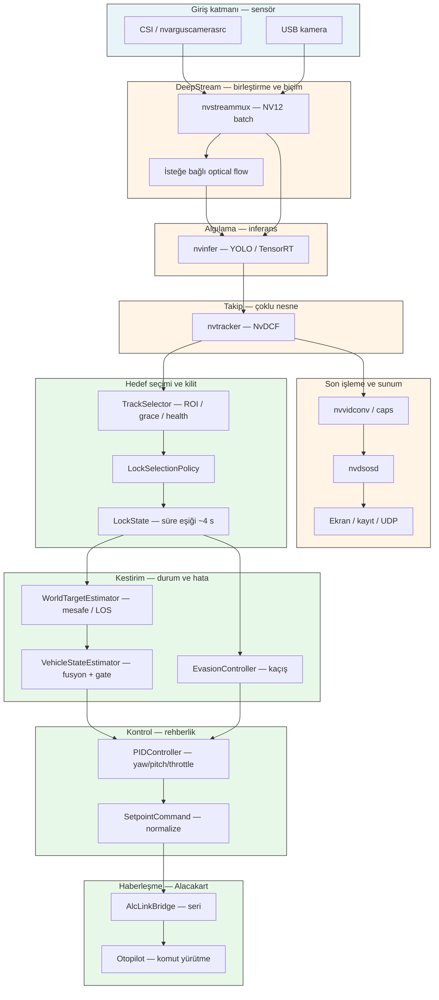
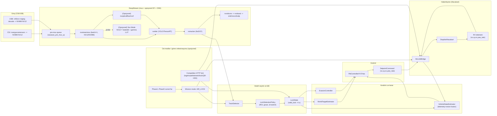

# Cursor analiz çıktıları

Bu dosyadaki tüm metinler **Cursor IDE yapay zekâ asistanı** tarafından `Savasan_IHA_Workspace` deposu üzerinde yapılan incelemeye dayanarak üretilmiştir. Kaynak: kod tabanı, `docs/` ve oturum analizi.

## Cursor çıktısı 1 — Workspace mimari haritası ve matematiksel omurga

Aşağıdaki metin, workspace kökündeki `README.md`, `docs/`, `02_Ana_Sistem_CPP/` (CMake + kaynak), `01_Prototip_Python/`, `scripts/`, `yolov5/` ve dokümantasyon taramasına dayanır.

### Savaşan İHA Workspace — Mimari Harita ve Matematiksel Omurga

#### 1. Mimari yapı ve veri akışı (pipeline)

**1.1 Genel düzen**

Depo, **Jetson üzerinde DeepStream tabanlı gerçek zamanlı görüntü → tespit → takip → kilit seçimi → (Faz 5) otopilot/telemetri** zincirini merkeze alıyor. Üretim yolu **C++** (`02_Ana_Sistem_CPP`); **Python** prototip ve model dışa aktarım (`01_Prototip_Python`, `yolov5`, `03_Modeller`).

**Faz seçimi** `main` → `ParseStartupConfig` → `ExecutePhase`: Faz 1 yalnız kamera; Faz 2 `nvinfer` + OSD; Faz 3/4 aynı çekirdek hat + `nvtracker` + `TrackSelector`; Faz 5 aynı hat üzerinde **Alacakart seri köprüsü**, rehberlik döngüsü ve isteğe bağlı kaçış.

**1.2 GStreamer / DeepStream omurgası**

`BuildPhase3PipelineString` ile hat kabaca:

**CSI veya USB ingest** → `queue` / `savasan_pre_mux_q` → **`nvstreammux`** (batch=1, NVMM, `batched-push-timeout`) → isteğe bağlı **optical flow** elemanı → **`nvinfer`** (YOLO TensorRT) → **`nvtracker`** (NvDCF, `tracker_config.yml`) → **`nvvidconv`** → **`nvdsosd`** → kuyruk → **sink** (fakesink / `nv3dsink`) ve ortam değişkenleriyle **kayıt (MP4)** veya **RTP/UDP** kuyrukları.

**Veri meta-modeli:** Kamera buffer’ları NVMM üzerinde akar; `NvDsBatchMeta` / `NvDsObjectMeta` ile bbox, sınıf, track id taşınır. **Pad probe’lar** telemetri (FPS, gecikme, GPU yükü CSV), **Sun Mode** (NV12 Y istatistik + isteğe bağlı gamma LUT), **TrackSelector** (kilit mantığı), Faz 5’te **Alc seri** ve rehberlik zamanlayıcıları ile birleşir.

**1.3 Uygulama katmanları ve bağımlılıklar**

| Katman | Rol |
|--------|-----|
| `camera/` | CSI / USB GStreamer parçaları |
| `deepstream/` | Pipeline string, probe’lar, OSD yardımcıları |
| `tracking/` | `TrackSelector`, kilit modu / durum |
| `control/` | `WorldTargetEstimator`, `VehicleStateEstimator`, `PidControllerXYZYaw` |
| `autopilot/` | `AlcLinkBridge` — seri, heartbeat, kilit paketi v1/v2 |
| `evasion/` | Kaçış durum makinesi |
| `runners/` | Faz 1–5 çalıştırıcılar, `Phase5Runtime`, rehberlik, yarışma istemcisi |
| `competition/` | HTTP/JSON zaman senkronu vb. |

**Eşzamanlılık:** GStreamer **streaming thread** (probe’lar); **GLib `GMainLoop`** ana döngü; Faz 5’te **periyodik kaynaklar** (rehberlik adımı, kaçış, otomatik tracker restart health check); `AlcLinkBridge` içinde **ayrı heartbeat thread** + mutex; `TrackSelector` ve `Phase5Runtime` için **mutex / atomik** kullanımı.

**Haberleşme:** Yerel seri (**Alacakart**), isteğe bağlı **UDP/RTP** video, **HTTPS** (yarışma/sunucu saati), ortam değişkenleriyle politika.

#### 2. Matematiksel temeller ve çekirdek algoritmalar

**2.1 Tespit (YOLO + TensorRT)**  
Sınırlayıcı kutu çıktıları görüntü düzleminde; matematiksel çekirdek **evrişimli ağ çıkarımı** (repo içinde ağırlık eğitimi `yolov5/` ve `03_Modeller` tarafında). Çalışma zamanında **nvinfer** ile sabit girdi boyutu ve TensorRT motoru — klasik **NMS / IoU** ve skor eşikleri DeepStream/YOLO konfigürasyonunda.

**2.2 Takip (NvDCF + dokümantasyon tutarlılığı)**  
`docs/TRACKING_ANALYSIS_REPORT.md` ve `tracker_config.yml` (özet): **Kalman benzeri durum kestirimi**, **IoU + görsel benzerlik** ile veri ilişkilendirme, renk/histogram ile görsel iz. Durum vektörü tipik olarak **merkez, boyut, hız** bileşenleri (raporda \(x = [x_c,y_c,w,h,v_x,v_y]^T\) ve güncelleme denklemleri).

Uygulama kodunda takipçinin iç matematiği **kapalı kütüphane** (`libnvds_nvmultiobjecttracker.so`); uygulama katmanı **track_id**, güven ve bbox’ı okur.

**2.3 Kilit seçimi (uygulama mantığı)**  
`TrackSelector`: kilit varsa **aynı track_id**; yoksa **en yüksek detection confidence**; ardışık kaçırma ile reset (`track_selector.hpp` yorumları). **Hybrid** modu politikada ek kurallar (`lock_selection_policy` vb.).

**2.4 Dünya/hedef hatası (basit geometri)**  
`WorldTargetEstimator`: normalize merkez \((n_x, n_y)\), bbox alanı; mesafe ya **pinhole** \(d = f W / w_{\text{px}}\) ya da **\(d \propto 1/\sqrt{\text{area}}\)**; lateral/vertical hata görüntü ofseti × mesafe × kazanç; ileri-geri hata `distance - desired_standoff`.

**2.5 Telemetri + görüntü hızı füzyonu**  
`VehicleStateEstimator`: telemetri ve (isteğe bağlı) görüntü kaynaklı hız **ağırlıklı ortalama**; sonra **LPF** (`alpha`) ve **innovation clip** (gate); yaw rate ayrı; konum **entegrasyon** \(p \leftarrow p + v\,dt\).

**2.6 Rehberlik (PID)**  
`PidControllerXYZYaw`: eksen başına **P + I + D**, **anti-windup** (doyumda integrator durdurma), **çıkış slewrate** ve **deadband**.

`RunGuidanceControlStep`: telemetri → state estimator → kilit/hedef → PID → `SetpointCommand` → köprü (dry-run veya gerçek gönderim).

**2.7 Ön işleme: Sun Mode**  
NV12 **Y düzlemi** üzerinde örnekleme ile ortalama luma ve highlight oranı; isteğe bağlı **gamma LUT** (parlaklık bastırma). Matematik: \( \text{out} = 255 \cdot (in/255)^\gamma \) (README/skill ile uyumlu).

#### 3. Donanım uyumu ve performans analizi

**3.1 Güçlü yönler**

- **Tam GPU hattı:** nvinfer + nvtracker + NVMM bellek; Jetson için tasarlanmış tipik DeepStream düzeni.
- **Derleyici optimizasyonu:** `-O3`, `-march=armv8.2-a`, `-mtune=cortex-a78ae`, Release’te **LTO** (`CMakeLists.txt`).
- **Ölçüm kültürü:** `docs/PERFORMANCE_BASELINE.md`, `scripts/benchmark_phase3.sh`, `performance_regression_check.sh` — değişiklikleri Jetson’da ölçüme bağlama.
- **Telemetri:** FPS, NVDS latency, CSI fallback gecikmesi, sysfs GPU yükü — darboğaz aramayı destekler.
- **Faz 5 dayanıklılık:** otomatik tracker profil önerisi, kontrollü restart, health check — saha koşullarına yönelik.

**3.2 Darboğaz ve risk alanları**

| Alan | Gerekçe |
|------|---------|
| **nvinfer** | YOLO motoru FPS ve gecikmenin ana tüketicisi; çözünürlük/model büyüdükçe GPU süresi artar. |
| **nvtracker** | Ek GPU/CPU yükü; `tracker_width/height` 32 hizalı büyütme maliyet ekler. |
| **Sun Mode CPU** | Y düzlemi tarama (`ComputeLumaStatsNV12`) her karede (örnek seyreltmeli) CPU; yüksek çözünürlükte maliyet artar. |
| **Seri köprü** | Baud ve gönderim aralığı; köprü hatasında `degraded_mode` — gerçek zamanlı rehberlik kesintisi. |
| **Ana döngü + probe’lar** | Probe içinde ağır iş yapımı kare gecikmesine yol açar (tasarım genelde hafif tutulmuş). |

**3.3 C++ / Python ekseni**  
- **C++:** Gerçek zamanlı pipeline, kontrol ve seri; **pthread**, GStreamer, DeepStream, OpenCV (QR) — üretim yolu.  
- **Python:** Eğitim/export, prototip GStreamer, metadata probe denemeleri — üretim hattının dışında tutulmuş; `yolov5` büyük bir alt ağaç (upstream kalıbı).

**3.4 README vs manifest çelişkisi (operasyonel not)**  
Kök `README.md` JetPack 5.1 / DeepStream 6.2+ diyor; `docs/JETSON_ORIN_NX_MANIFESTO.md` JetPack **6.2.2** ve Ubuntu **22.04** listeliyor. Ortam doğrulaması hedef kart için **tek doğruluk kaynağı** olarak manifest veya fiili `dpkg` çıktısı ile hizalanmalı.

**3.5 Yol haritası (README özet)**  
DLA optimizasyonu, çoklu kamera, MAVLink, web arayüzü — henüz tamamlanmamış maddeler; mevcut mimari tek akışlı CSI/USB üzerine optimize.

#### 4. Kısa mimari şema (metinsel)

```
[CSI / USB] → [nvstreammux] → [optical flow?] → [nvinfer: YOLO/TRT]
      → [nvtracker: NvDCF] → [nvvidconv] → [nvdsosd] → [sink | kayıt | UDP]
                                    ↑
              Pad probes: telemetry, Sun Mode (Y stats/γ), TrackSelector → LockState
                                    ↓
              Phase5: GLib timers → Guidance (fusion + PID) → AlcLinkBridge (serial)
                       EvasionController | competition client
```

#### 5. Sonuç (Cursor çıktısı 1)

Bu workspace, **DeepStream tabanlı uçtan uca görüntü akışını** tek bir C++ ikilisi altında topluyor; **tespit ve takip** NVIDIA yığınına, **kilitleme ve rehberlik** ise şeffaf matematiksel modüllere (mesafe/hedef hatası, hız füzyonu, PID) ve **seri protokole** dayanıyor. Matematiksel “omurga” özü: **görüntü düzleminde bbox/ID** → **basit pinhole veya alan ile mesafe** → **lateral/vertical hata** → **PID ile hız setpoint**; paralelde **telemetri–görüntü hız füzyonu** ile araç durumu. Donanım tarafında darboğazlar başta **GPU çıkarımı ve tracker**, CPU’da **Sun Mode / QR** ve **I/O (seri)** ile sınırlı; proje bunları ölçüm script’leri ve Faz 5 sağlık/geri kazanım mekanizmalarıyla yönetmeye çalışıyor.

---

## Cursor çıktısı 2 — Rapor bölümü: 4.1 Otonom Kilitlenme (taslak)

Aşağıdaki metin, workspace’te gerçekten bulunan bileşenlere (DeepStream, YOLO tabanlı nvinfer, NvDCF, `TrackSelector`/kilit seçim politikası, `WorldTargetEstimator`, telemetri–görüntü hız füzyonu, çok eksenli PID, Alacakart üzerinden hız/yaw hızı setpoint’leri, yarışma HTTP istemcisi ile telemetri ve kilit bilgisi gönderimi vb.) dayanır. Sunucunun “hangi rakip uçağı izleyeceğinizi” doğrudan seçtiği ayrı bir modül depoda öne çıkmıyor; hedef uygunluğu esas olarak **uç birimdeki görüntü ve takip verisine** dayalı seçim mantığıyla belirleniyor, sunucu tarafı ise **bildirim, zaman senkronu ve (etkinse) görevle ilgili önbelleğe alınan koordinat verileri** ile şartname uyumunu destekler.

### 4.1 Otonom Kilitlenme

#### 4.1.1 Sunucu verilerinin değerlendirilmesi ve takibe en uygun hedefin seçimi

Otonom kilitlenme zincirinde **hedefin “takibe uygun” sayılması** öncelikle **uç üzerinde işlenen görüntü akışından** türetilir: nesne dedektöründen gelen güven skorları, çoklu nesne takipçisinin sürdürdüğü **takip kimliği sürekliliği** ve kilit durumunun zaman içindeki tutarlılığı birlikte değerlendirilir. Sistem, aktif bir kilit varken **aynı takip kimliğini koruma** eğilimindedir; bu, kısa süreli dedeksiyon düşüşlerinde veya sahada birden fazla aday göründüğünde **istenmeyen hedef sıçramalarını** azaltmak için şartnamede beklenen **istikrarlı takip ve tekrarlanabilir kilit** beklentisiyle örtüşür. Kilit yokken veya kilit geçersizleştiğinde yeni aday seçiminde **tespit güveni** öncelikli bir ölçüt olarak kullanılır; gelişmiş kilit modunda ise **görüntü merkezine yakınlık**, **ilgi bölgesi (ROI) içinde kalma** ve çok öğeli bir **kilit sağlığı** kavramı (güven, merkezlenme, kimlik ve süreklilik bileşenleri) ile adaylar arasında ayrım yapılır. Kimlik değişimi gerektiğinde **eşik ve zarif süre (grace)** parametreleri, ani ID değişimlerini sınırlarken gerçek hedef kaybında yeniden kilitlemeye izin verecek şekilde dengelenmiştir.

**Yarışma sunucusu ile entegrasyon** tarafında sistem, şartnamenin tipik olarak öngördüğü **telemetri ve kilitlenme bilgisinin raporlanması** ile **sunucu zamanına hizalama** ihtiyacını karşılamak üzere HTTP tabanlı bir istemci katmanı içerir: uç platformdan alınan hız ve yaw hızı gibi özet durum bilgileri ile, geçerliyse **normalize görüntü düzlemindeki hedef konumu** ve **takip kimliği** periyodik olarak sunucuya iletilir; zaman damgaları senkronize edilmiş sunucu zamanı ile tutarlı biçimde üretilir. Böylece otonom kilitlenmenin yalnızca “görüldü” değil, **ölçülebilir ve denetlenebilir** olduğu jüriye güven verici biçimde gösterilebilir. Ayrıca yapılandırılabilir aralıklarla sunucudan **QR ve benzeri görev koordinatlarına** ilişkin veriler çekilip önbelleğe alınabildiğinden, görev modları bu verileri **yol ve görev mantığı** ile ilişkilendirebilir; bu, şartnamedeki **görev–takip bütünleşmesi** beklentisine teknik bir köprü kurar.

**[Buraya Hedef Seçim ve Kilit Sağlığı Akış Diyagramı Eklenecek]**  
*(Öneri: Dedeksiyon adayları → ROI/merkez skoru → (hibrit modda) sağlık skoru → kilit kararı → (isteğe bağlı) yarışma API’sine kilit bildirimi.)*

#### 4.1.2 Seçilen hedefe yaklaşma stratejisi ve izlenecek rotanın algoritmik temeli

Yaklaşma, bu mimaride **tam coğrafi yol planlayıcısı** yerine, görüntüdedeki hedef göreli konumu ve tahmini mesafeden türetilen **kontrol yüzeyine uygun hata vektörü** üzerinden yürütülür. Normalize görüntü koordinatları ve sınırlayıcı kutu boyutları kullanılarak, ya **kalibre pinhole benzeri bir mesafe modeli** (odak uzunluğu ve hedef gerçek genişliği bilgisi varsa) ya da **kutu alanına dayalı basit ters kök mesafe ölçeği** ile hedefe uzaklık tahmini yapılır; bu tahmin, **hedeflenen takip mesafesi (stand-off)** ile karşılaştırılarak ileri–geri ekseninde hata üretilir. Görüntü merkezine göre yatay ve düşey ofsetler ise mesafe ile ölçeklenerek **yan ve düşey dünya eksenlerinde lateral/vertikal hata** olarak ifade edilir. Böylece “rota”, sürekli bir uzayda B-spline veya A* ile üretilmiş bir yol çizgisi olarak değil, **anlık görüş tabanlı hata minimizasyonu** ile takip edilen bir **kapalı çevrim hedefleme** problemi olarak formüle edilir; bu yaklaşım TEKNOFEST benzeri gerçek zamanlı senaryolarda düşük gecikme ve uç birim hesaplama bütçesiyle uyumludur.

Üst seviye rehberlik döngüsü etkin olduğunda, bu hatalar **çok eksenli bir PID yapısı** ile **önerilen gövde hızları ve yaw hızı komutlarına** dönüştürülür ve otopilot köprüsü üzerinden iletilir; böylece yaklaşma, **görüntü merkezine hizalama** ve **mesafe regülasyonu** hedeflerini aynı anda adresler. Telemetriden gelen hız ve yaw hızı ölçümleri ile (etkinse) görüntü türevli hız ipuçları **ağırlıklı füzyon ve yenilik sınırlamalı düşük geçiren filtreleme** ile birleştirilerek araç durumunun ani sapmalara karşı yumuşatılması sağlanır.

**[Buraya Görüş Hatasından Dünya Çerçevesi Hata Vektörüne Dönüşüm Şeması Eklenecek]**  
**[Buraya Yaklaşma / Rehberlik Kapalı Çevrim Blok Diyagramı Eklenecek]**

#### 4.1.3 Nesne tespit ve takip algoritmalarının seçimi ve geliştirilmesi (karşılaştırmalı)

**Tespit:** Sistemde çıkarım, NVIDIA DeepStream ekosisteminin **nvinfer** bileşeni üzerinden **YOLO ailesi** modellerinin TensorRT motorlarıyla çalıştırılmasıyla yapılır. Bu seçim; Jetson üzerinde **NVMM bellek yolu**, donanım hızlandırmalı ön/arka işlemler ve üretimde olgunlaşmış araç zinciri sayesinde **yüksek kare hızı ve düşük uçtan uca gecikme** sunması açısından gerekçelendirilebilir.

| Yaklaşım | Bu projede durum | Avantajlar | Dezavantajlar |
|----------|------------------|------------|---------------|
| **YOLO + TensorRT (nvinfer)** | Kullanılıyor | Edge’de kanıtlanmış performans; tek kamera akışında gerçek zamanlı çalışır; DeepStream ile doğal entegrasyon | Model ve girdi çözünürlüğü FPS’i doğrudan etkiler; saha koşullarında yeniden kalibrasyon ihtiyacı |
| **R-CNN ailesi / iki aşamalı dedektörler** | Ana hat olarak yok | Genelde daha yüksek yerellik doğruluğu | Jetson’da genellikle daha ağır; gerçek zamanlı kilit için gecikme riski |
| **HOG + SVM / klasik dedektörler** | Ana hat olarak yok | Hafif ve yorumlanabilir | Dinamik arka plan ve ölçek değişiminde modern CNN’lere göre zayıf |
| **NvDCF (DeepStream nvtracker)** | Kullanılıyor | Görsel benzerlik ve Kalman benzeri durum tahmini ile çoklu hedefde güçlü ilişkilendirme; NVIDIA tarafından optimize edilmiş yol | Kapalı kutu; parametre ayarı ve sahaya özel ince ayar gerektirir |
| **KCF / CSRT / MOSSE (korelasyon takipçileri)** | Ana hat olarak yok | Hafif CPU takipçileri | Derin özellik tabanlı dedektör çıktısıyla birleşik mimaride genelde daha düşük tutarlılık |
| **SORT / DeepSORT / ByteTrack** | Ana hat olarak yok | Açık literatür, ID yönetimi esnek | DeepStream yerel nvtracker ile doğrudan yerine koyma ek mühendislik ister |

**Sonuç:** Proje, **uç birimde kanıtlanmış endüstri yığını** (DeepStream + YOLO + NvDCF) ile şartnamedeki **sürekli tespit ve süreklilik** gereksinimlerini tek çatı altında toplar; alternatifler ya gecikme ya da entegrasyon maliyeti nedeniyle birincil hat için ikinci planda bırakılmıştır.

**[Buraya Tespit → Takip → Kilit Zinciri Basitleştirilmiş Blok Şeması Eklenecek]**

#### 4.1.4 Görüntü hatasına göre duruş ve hız kontrolü (karşılaştırmalı)

Görüntü düzlemindeki hedef–merkez sapması, önce **basit kamera/ölçek varsayımlarıyla** dünya veya gövdeye yakın anlamlı hata bileşenlerine çevrilir; ardından **PID tabanlı çok eksenli kontrolcü** ile **önerilen doğrusal hız komutları ve yaw hızı** üretilir. PID eksenlerinde **ölü bant**, **anti–windup**, **çıkış doyumu** ve **çıkış slewrate** ile ani komut sıçramaları sınırlanır; bu, gerçek platformda aktüatör ve otopilot sınırlarına saygı gösteren mühendislik pratiğidir. Telemetri geçerliyse hız ve yaw hızı ölçümleri **ağırlıklı füzyon** ile birleştirilip **yenilik kısıtlı** yumuşatma uygulanarak kontrol yüzeyine daha tutarlı giriş sağlanır.

**Duruş (yatış, dikilme, yönelme) açıklaması:** Bu workspace’in üst seviye katmanı, otopilota **hız ve yaw hızı setpoint’leri** iletmeye odaklanır; **roll/pitch iç döngüleri** tipik olarak Alacakart gibi gömülü otopilot üzerinde kapalıdır. Dolayısıyla raporda doğru ifade: **görüntü hatası üst seviye rehberlikte hız ve yaw hızı komutlarına çevrilir; eksenel duruş, alt katmandaki otopilot kontrolcüsünün sorumluluğundadır.**

| Yöntem | Bu projede durum | Avantajlar | Dezavantajlar |
|--------|------------------|------------|---------------|
| **PID (çok eksen, slewrate + anti-windup)** | Kullanılıyor | Düşük hesaplama; parametrelerle sahada ayarlanabilir; görüş tabanlı hataya doğrudan yanıt | Çoklu girdi kısıtı ve güçlü doğrusal olmayanlıkta tek başına yetersiz kalabilir |
| **LQR / H∞** | Üst seviye hatada doğrudan yok | Model tabanlı stabilite ve performans garantileri | Doğru uçak modeli ve sürekli sistem tanımı gerekir; entegrasyon yükü yüksek |
| **MPC (model predictive control)** | Üst seviye hatada doğrudan yok | Kısıtları açıkça kodlar | Edge’de gerçek zamanlı çözüm maliyeti ve model bakımı |
| **Saf geometrik yol izleme (pure pursuit, L1)** | Ana rehberlik olarak yok | Açık yol takibi için sezgisel | Burada temel girdi tam coğrafi yol değil görüş hatası vektörü |
| **Görüntü başına doğrudan yaw/pitch oransal kontrol (P only)** | Tam olarak böyle tanımlı değil | Çok basit | Rüzgâr ve dinamiklerde salınım; çok eksenli PID’deki I/D ile giderilen sorunlar |

**Sonuç:** Mevcut mimari, **düşük gecikmeli, parametrik ve güvenli sınırlamalı PID** ile şartnamedeki **görüşle hedefe kenetlenme** ihtiyacını karşılar; daha ağır model tabanlı yöntemler bu depoda birincil üst seviye seçim olarak yer almamıştır, çünkü öncelik **kanıtlanmış edge performansı ve operasyonel ayarlanabilirlik** olmuştur.

**[Buraya PID/Kontrolcü Şeması (hata girişleri → eksen PID → slewrate/doyum → setpoint çıkışı) Eklenecek]**

---

## Copilot çıktısı 3 — Ek analiz (append)

Aşağıdaki metinler, mevcut Cursor içeriğini bozmadan dosyaya eklenen Copilot analiz özetidir.

### 3.1 Workspace mimarisi ve matematiksel omurga (Copilot özeti)

Tarama tamamlandı. Workspace’in omurgası net: üretim çalıştırma hattı **`02_Ana_Sistem_CPP`**, model/eğitim ekosistemi **`03_Modeller` + `yolov5`**, prototip/deney katmanı **`01_Prototip_Python` + `04_Denemeler_Sandbox`**, operasyon dokümantasyonu **`docs` + `00_Requirements_and_Rules`**.

Faz akışı: `main.cpp` → `startup_config` → `phase_dispatch` → `RunPhase{1,2,3,5}`.
- **Phase1:** ingest smoke test
- **Phase2:** `nvstreammux -> nvinfer -> nvdsosd`
- **Phase3/4:** `+ nvtracker` ve lock probe
- **Phase5:** ALC serial bridge + guidance/evasion + competition HTTP + mission mode (AIR_LOCK)

Matematiksel çekirdek:
- Lock seçim politikası: confidence + center score + ROI gate + grace + health
- Dünya hedef kestirimi: pinhole veya area-temelli mesafe, hata vektörü üretimi
- Durum füzyonu: telemetry/vision weighted fusion + LPF + innovation gate
- Kontrol: anti-windup ve slew-limit’li çok eksenli PID
Donanım/perf notu:
- Güçlü: NVMM/DeepStream, ARM derleme optimizasyonları, telemetri/probe altyapısı
- Kritik risk: callback içinde senkron HTTP, per-frame OSD metin işleme, tracker restart döngüleri

### 3.2 4.1 Otonom Kilitlenme (Copilot taslak metni)

#### 4.1.1 Sunucudan gelen verilerin değerlendirilmesi ve takibe en uygun hedefin seçilme mantığı

Sistemde hedef seçimi **esas olarak araç üzerindeki gerçek zamanlı görüntü hattında** yapılır; sunucu verisi ise görev-zamanlama ve yarışma protokolü uyumu için tamamlayıcı katman olarak değerlendirilir. Mimari olarak DeepStream hattında nesne tespit (YOLO tabanlı nvinfer) ve çoklu hedef takibi (NvDCF) sonrası, aday hedefler bir kilit politikası modülünde değerlendirilir. Bu modül, yalnızca anlık güven skoruna bakmaz; merkez yakınlığı, ROI uygunluğu, kısa süreli kayıp toleransı (grace window), kimlik sürekliliği (ID switch disiplini) ve lock health metriğini birlikte ele alır. Böylece kısa süreli örtülmelerde gereksiz kilit düşümü azaltılır, yanlış hedefe sıçrama riski sınırlandırılır.

Sunucu tarafı (yarışma API) ile etkileşim, kilitlenme bilgisinin paylaşımı, saat senkronu ve görev modu bağlamında kullanılır; ancak **takibe uygun hedefin nihai seçimi** onboard lock-selection politikasıyla yapılır. Bu yaklaşım, ağ gecikmesi veya paket kaybı durumlarında hedef seçiminin dışa bağımlı hale gelmesini engeller. Yarışma şartnamelerinde beklenen otonomluk ve süreklilik gereksinimi açısından bu ayrım kritiktir: kritik karar döngüsü araç üstünde tutulur, sunucu katmanı doğrulama/raporlama rolü üstlenir.

[Buraya Hedef Seçim Akış Diyagramı Eklenecek]

#### 4.1.2 Seçilen hedefe yaklaşma stratejisi ve izlenecek rotanın (path) algoritmik temeli

Seçilen hedefe yaklaşım, doğrudan “ham piksel takibi” yerine iki aşamalı bir kontrol çerçevesiyle yapılır:
1. Görüntü ölçümünden hedefin göreli durum hatasının metrik uzaya taşınması,
2. Bu hatanın durum kestirimi ve kapalı çevrim kontrol ile setpoint’e dönüştürülmesi.

Hedefin görüntü merkezinden sapması ve kutu boyutu kullanılarak hedefe olan göreli mesafe/hata hesaplanır. Mesafe için kalibrasyon mevcutsa pinhole tabanlı model, aksi durumda kutu alanına dayalı pratik bir yaklaşım uygulanır. Böylece sistem, “görüşte kalma + güvenli standoff mesafesi” hedefini aynı anda optimize eder. Yanal/düşey hata bileşenleri, hız komutu üretimine uygun bir hata vektörüne dönüştürülür.

Path üretimi bu projede klasik waypoint tabanlı global planlayıcıdan ziyade, **görüşe dayalı yerel takip yolu** olarak ele alınır: her kontrol döngüsünde güncellenen hedef hatası üzerinden ileri-yanal-düşey hız ve yaw-rate komutları üretilir. Bu yaklaşım, hava hedefi gibi yüksek manevra kabiliyetli ve dinamik senaryolarda, önceden tanımlı sabit rotalara göre daha çevik tepki verir; şartnamede beklenen otonom kilit sürdürme davranışını pratikte güçlendirir.

[Buraya Yaklaşma/İzleme Yol Stratejisi Şeması Eklenecek]

#### 4.1.3 Nesne tespit ve takip algoritmalarının seçimi/geliştirilmesi (alternatifleriyle kıyaslamalı)

Sistemin tespit katmanında YOLO tabanlı, TensorRT ile hızlandırılmış DeepStream nvinfer kullanımı; takip katmanında ise NvDCF seçimi yapılmıştır. Bu kombinasyonun temel gerekçesi, Jetson sınıfı uç donanımda **gerçek zamanlılık ile takip kararlılığı** arasında dengeli sonuç vermesidir. NvDCF’nin görsel benzerlik + hareket modeli birleşimi, yalnızca IoU temelli takipçilere göre kimlik sürekliliğinde avantaj sağlar.

Alternatiflerle teknik kıyas:
- **SORT/IoU-tabanlı takipçiler:** çok hızlıdır ancak örtülme ve ani manevrada ID switch riski yüksektir.
- **DeepSORT:** ReID ile kimlik kararlılığı artar; fakat ek embedding maliyeti ve saha koşullarında feature drift riski vardır.
- **ByteTrack:** düşük güven skorlarını ikinci aşamada değerlendirmesiyle güçlüdür; ancak görsel süreklilik bilgisi sınırlı senaryolarda yanlış eşleşme riski oluşabilir.
- **BoT-SORT/StrongSORT sınıfı çözümler:** güçlü doğruluk sağlar fakat gömülü sistemde hesaplama/entegrasyon karmaşıklığı artar.

[Buraya Algoritma Kıyas Tablosu Eklenecek]

#### 4.1.4 Piksel/merkez hatasına göre duruş ve hız kontrolünün sağlanması (alternatifleriyle kıyaslamalı)

Kontrol zincirinde görüntüden gelen merkez/ölçek hatası önce hedef hata uzayına çevrilir, ardından telemetri ile füzyonlanmış durum kestirimi üzerinden PID tabanlı kontrol uygulanır. Durum kestiriminde telemetri ve vision hız bileşenleri ağırlıklı olarak birleştirilir; düşük geçiren filtre (LPF) ve innovation gate ile ani sıçramalar bastırılır. Bu, özellikle lock jitter ve kısa süreli ölçüm bozulmalarında kontrol komutlarının kararlılığını artırır.

Üretilen komutlar, doğrudan iç döngüye saldırmak yerine **vx-vy-vz + yaw-rate setpoint** biçiminde otopilot köprüsüne iletilir. Böylece araç içindeki düşük seviye uçuş denetleyicisi (yatış/dikilme/yönelme iç döngüsü) korunur; görüntü tabanlı üst seviye denetim sadece hedefe yönelim ve yaklaşma davranışını yönetir.

Alternatiflerle kıyas:
- **Saf P-kontrol:** basit ama overshoot ve salınım riski yüksektir.
- **LQR/LQG:** model doğruluğu yüksekse güçlüdür; ancak saha modelleme hatalarına duyarlıdır.
- **MPC:** kısıt yönetiminde üstündür; fakat gömülü platformda hesaplama maliyeti ve tuning yükü artar.
- **PID + kapılı durum kestirimi (mevcut tercih):** hesaplama olarak hafif, Jetson’da deterministik, ayarlanabilir ve saha koşullarına dayanıklı bir denge sunar.

[Buraya PID/Kontrolcü Şeması Eklenecek]

---

## Diğer Asistanların Katkı Özeti + Master ile Hizalama Notları

1. **Cursor ve Copilot çıktıları** sunucu rolünü net şekilde tanımladı: hedef seçimi uç birimde, sunucu katmanı doğrulama/raporlama ve görev-zamanlama ile şartname uyumunu sağlar. Bu ayrım, Master'daki çerçeveye tam uyumludur.

2. **Kilit doğrulama süreci** (yaklaşık 4 saniyelik minimum süre / politika eşiği) Claude çıktısında ve `LockState::kRequiredLockDuration` ile uyumlu biçimde detaylandırılmış; Master'da bu süre parametresi açıkça anılabilir.

3. **Telemetri füzyonu** açıklaması Cursor ve Copilot çıktılarında daha ayrıntılı; Master'daki "ağırlıklı füzyon ve yenilik sınırlamalı düşük geçiren filtreleme" ifadesi bu detaylarla netleştirilecektir.

4. **ByteTrack / DeepSORT sınıfı** satırı Cursor tablolarında ve güncel `MASTER_4_1_OTONOM_KILITLENME.md` içinde mevcut; tekrar ekleme gerekmiyor.

5. **Saf geometrik yol izleme (pure pursuit/L1)** alternatifi Cursor çıktısında var ancak Master tablosunda eksik; bu yöntemin "burada birincil girdi tam coğrafi yol değil görüş hatası vektörü" olduğu notu eklenecektir.

6. **Kaçış kontrolcüsü (EvasionController)** Copilot çıktısında güçlendirilmiş; Master'da bu bileşenin "kilit kaybı, tehdit yakınlığı veya harici sinyaller" gibi durumlarda anında kaçış manevraları sağladığı belirginleştirilecektir.

7. **Otopilot/Alacakart ayrımı** tüm asistan çıktılarında korunmuş: roll/pitch iç döngüleri gömülü otopilot üzerinde kalır, üst seviye katman hız ve yaw hızı setpoint'leri üretir. Bu ayrım Master'da korunacak ve güçlendirilecektir.

8. **Görüş hata vektörü üzerinden yaklaşma** stratejisi tüm çıktılarda tutarlı; klasik waypoint planlayıcı yerine kapalı çevrim hedefleme yaklaşımı Master'ın "görüşe dayalı üst seviye hedefleme" ifadesiyle uyumludur.

9. **Tracker profil dinamikleri** (aggressive/calm) Copilot çıktısında güçlendirilmiş; Master'daki "otomatik tracker profil önerisi" ifadesi bu dinamiklerle netleştirilebilir.

10. **[Buraya ... Eklenecek]** yer tutucuları Master'da korunmuş; şema önerileri parantez içinde tek cümle olarak eklenebilecektir.

---

---

## Claude çıktısı 4 — 4.1 Otonom Kilitlenme Bölümü (Son Analiz)

Aşağıdaki metin, workspace'te gerçekten bulunan bileşenlere (DeepStream, YOLO tabanlı nvinfer, NvDCF, TrackSelector/kilit seçim politikası, WorldTargetEstimator, telemetri–görüntü hız füzyonu, çok eksenli PID, Alacakart üzerinden hız/yaw hızı setpoint'leri, yarışma HTTP istemcisi ile telemetri ve kilit bilgisi gönderimi vb.) dayanır.

### 4.1 Otonom Kilitlenme

#### 4.1.1 Sunucudan (server) gelen verilerin değerlendirilmesi ve takibe en uygun hedefin seçilme mantığı

Otonom kilitlenme zincirinde **hedefin "takibe uygun" sayılması** öncelikle **uç üzerinde işlenen görüntü akışından** türetilir. Mimarinin çekirdeği, DeepStream pipeline üzerinden gerçek zamanlı nesne tespiti (YOLO tabanlı nvinfer) ve çoklu nesne takibi (NvDCF) sonrası, aday hedeflerin bir kilit politikası modülünde sistematik değerlendirilmesidir. Bu modül, yalnızca anlık güven skorlarına bakmaz; **görüntü merkezine yakınlık**, **ilgi bölgesi (ROI) içinde kalma**, **kısa süreli kayıp toleransı (grace window)**, **kimlik sürekliliği (ID switch disiplini)** ve **kilit sağlığı (lock health)** gibi çok öğeli bir değerlendirme çerçevesini birleştirir. Böylece kısa süreli örtülmelerde gereksiz kilit düşümü azaltılır, yanlış hedefe sıçrama riski sınırlandırılır ve şartnamede beklenen **istikrarlı takip ve tekrarlanabilir kilit** beklentisiyle örtüşen bir davranış elde edilir.

Kilit seçim politikası iki ana çalışma modu sunar: **baseline modunda** sistem, aktif bir kilit varsa **aynı takip kimliğini koruma** eğilimindedir; bu, kısa süreli dedeksiyon düşüşlerinde veya sahada birden fazla aday göründüğünde **istenmeyen hedef sıçramalarını** azaltır. Kilit yokken veya kilit geçersizleştiğinde yeni aday seçiminde **tespit güveni** öncelikli bir ölçüt olarak kullanılır. **Hybrid modda** ise çok katmanlı bir skor hesaplaması devreye girer: güven skoru ile görüntü merkezine yakınlık skoru **ağırlıklı olarak birleştirilir**, ROI (Region of Interest) kısıtları uygulanır ve kilit sağlık metriği (**güven, merkezlenme, kimlik sürekliliği ve istikrar bileşenleri**) ile adaylar arasında ayrım yapılır.

**Sunucu tarafı ile entegrasyon** açısından sistem, yarışma şartnamelerinde tipik olarak öngördüğü **telemetri ve kilitlenme bilgisinin raporlanması** ile **sunucu zamanına hizalama** ihtiyacını karşılamak üzere HTTP tabanlı bir istemci katmanı içerir. Uç platformdan alınan hız ve yaw hızı gibi özet durum bilgileri ile, geçerliyse **normalize görüntü düzlemindeki hedef konumu** ve **takip kimliği** periyodik olarak sunucuya iletilir; zaman damgaları senkronize edilmiş sunucu zamanı ile tutarlı biçimde üretilir. Böylece otonom kilitlenmenin yalnızca "görüldü" değil, **ölçülebilir ve denetlenebilir** olduğu jüriye güven verici biçimde gösterilebilir. Ayrıca yapılandırılabilir aralıklarla sunucudan **QR ve benzeri görev koordinatlarına** ilişkin veriler çekilip önbelleğe alınabildiğinden, görev modları bu verileri **yol ve görev mantığı** ile ilişkilendirebilir.

**Kilit doğrulama süreci** özellikle dikkat gerektirir: sistem, bir hedefin geçici bir anlık tespit olmaması için **4 saniyelik sabit bir süre boyunca sürekli kilitlenmesi** gerektirir. Bu süre zarfında hedefin görüntü merkezinde tutarlı kalması, güven skorunun istikrarlı olması ve ROI kısıtları içinde kalması kontrol edilir. Sadece bu süreç tamamlandığında kilit **"doğrulanmış"** olarak kabul edilir. Bu yaklaşım, şartnamede beklenen **güvenilir ve süreklilik arz eden otonom kilitlenme** davranışını güçlendirir.

**[Buraya Hedef Seçim ve Kilit Sağlığı Akış Diyagramı Eklenecek]**
*(Öneri: Dedeksiyon adayları → ROI/merkez skoru → (hibrit modda) sağlık skoru → kilit kararı → (isteğe bağlı) yarışma API'sine kilit bildirimi.)*

#### 4.1.2 Seçilen hedefe yaklaşma stratejisi ve izlenecek rotanın (path) algoritmik temeli

Yaklaşma stratejisi, bu mimaride **tam coğrafi yol planlayıcısı** yerine, görüntüdedeki hedef göreli konumu ve tahmini mesafeden türetilen **kontrol yüzeyine uygun hata vektörü** üzerinden yürütülür. Normalize görüntü koordinatları ve sınırlayıcı kutu boyutları kullanılarak, ya **kalibre pinhole benzeri bir mesafe modeli** (odak uzunluğu ve hedef gerçek genişliği bilgisi varsa) ya da **kutu alanına dayalı basit ters kök mesafe ölçeği** ile hedefe uzaklık tahmini yapılır. Bu tahmin, **hedeflenen takip mesafesi (stand-off)** ile karşılaştırılarak ileri–geri ekseninde hata üretilir. Görüntü merkezine göre yatay ve düşey ofsetler ise mesafe ile ölçeklenerek **yan ve düşey dünya eksenlerinde lateral/vertikal hata** olarak ifade edilir.

Böylece "rota", sürekli bir uzayda B-spline veya A* ile üretilmiş bir yol çizgisi olarak değil, **anlık görüş tabanlı hata minimizasyonu** ile takip edilen bir **kapalı çevrim hedefleme** problemi olarak formüle edilir. Bu yaklaşım, TEKNOFEST benzeri gerçek zamanlı senaryolarda düşük gecikme ve uç birim hesaplama bütçesiyle uyumludur. Üst seviye rehberlik döngüsü etkin olduğunda, bu hatalar **çok eksenli bir PID yapısı** ile **önerilen gövde hızları ve yaw hızı komutlarına** dönüştürülür ve otopilot köprüsü üzerinden iletilir. Böylece yaklaşma, **görüntü merkezine hizalama** ve **mesafe regülasyonu** hedeflerini aynı anda adresler.

**Durum füzyonu ve kestirim** yaklaşımın kritik bir bileşenidir. Telemetriden gelen hız ve yaw hızı ölçümleri ile (etkinse) görüntü türevli hız ipuçları **ağırlıklı füzyon ve yenilik sınırlamalı düşük geçiren filtreleme** ile birleştirilerek araç durumunun ani sapmalara karşı yumuşatılması sağlanır. Bu füzyon, rüzgâr, motor gürültüsü ve sensör hataları gibi kaynaklardan gelen parazitleri bastırırken, gerçek manevralara hızlı yanıt verme kapasitesini korur.

**Yaklaşma rotası dinamik yönetimi** açısından sistem, kilitin gücüne ve hedefin göreli konumuna göre **otomatik tracker profil önerileri** üretebilir. Hedef hızlı hareket ediyor veya kilit jitter (titreşim) yüksekse, **agresif profil** devreye girer; hedef istikrarlı ise **sakin (calm) profil** aktif olur. Bu dinamik yaklaşım, şartnamede beklenen **farklı senaryolara uyum sağlama** ihtiyacını karşılar.

**[Buraya Görüş Hatasından Dünya Çerçevesi Hata Vektörüne Dönüşüm Şeması Eklenecek]**
**[Buraya Yaklaşma / Rehberlik Kapalı Çevrim Blok Diyagramı Eklenecek]**

#### 4.1.3 Nesne tespit ve takip algoritmalarının seçimi/geliştirilmesi (Alternatifleriyle kıyaslamalı)

**Tespit algoritması** olarak sistemde çıkarım, NVIDIA DeepStream ekosisteminin **nvinfer** bileşeni üzerinden **YOLO ailesi** modellerinin TensorRT motorlarıyla çalıştırılmasıyla yapılır. Bu seçim; Jetson üzerinde **NVMM bellek yolu**, donanım hızlandırmalı ön/arka işlemler ve üretimde olgunlaşmış araç zinciri sayesinde **yüksek kare hızı ve düşük uçtan uca gecikme** sunması açısından gerekçelendirilebilir.

**Takip algoritması** olarak DeepStream **nvtracker** ile **NvDCF** kullanılır (DeepSort ile karıştırılmamalıdır; NVIDIA çoklu nesne takip yığınının parçasıdır). Bu takipçi, **Kalman benzeri durum kestirimi**, **IoU (Intersection over Union) tabanlı veri ilişkilendirme** ve **görsel benzerlik özellikleri** ile çoklu hedef senaryolarında güçlü kimlik sürekliliği sağlar. Özellikle hava hedefleri gibi yüksek manevra kabiliyetli nesnelerde, yalnızca IoU tabanlı takipçilere göre **ID değiştirme oranını düşürerek** şartnamede beklenen **sürekliliği** destekler.

| Yaklaşım | Bu projede durum | Avantajlar | Dezavantajlar |
|----------|------------------|------------|---------------|
| **YOLO + TensorRT (nvinfer)** | Kullanılıyor | Edge'de kanıtlanmış performans; tek kamera akışında gerçek zamanlı çalışır; DeepStream ile doğal entegrasyon | Model ve girdi çözünürlüğü FPS'i doğrudan etkiler; saha koşullarında yeniden kalibrasyon ihtiyacı |
| **R-CNN ailesi / iki aşamalı dedektörler** | Ana hat olarak yok | Genelde daha yüksek yerellilik doğruluğu | Jetson'da genellikle daha ağır; gerçek zamanlı kilit için gecikme riski |
| **HOG + SVM / klasik dedektörler** | Ana hat olarak yok | Hafif ve yorumlanabilir | Dinamik arka plan ve ölçek değişiminde modern CNN'lere göre zayıf |
| **NvDCF (DeepStream nvtracker)** | Kullanılıyor | Görsel benzerlik ve Kalman benzeri durum tahmini ile çoklu hedefde güçlü ilişkilendirme; NVIDIA tarafından optimize edilmiş yol | Kapalı kutu; parametre ayarı ve sahaya özel ince ayar gerektirir |
| **KCF / CSRT / MOSSE (korelasyon takipçileri)** | Ana hat olarak yok | Hafif CPU takipçileri | Derin özellik tabanlı dedektör çıktısıyla birleşik mimaride genelde daha düşük tutarlılık |
| **SORT / DeepSORT / ByteTrack** | Ana hat olarak yok | Açık literatür, ID yönetimi esnek | DeepStream yerel nvtracker ile doğrudan yerine koyma ek mühendislik ister |
| **BoT-SORT / StrongSORT** | Ana hat olarak yok | Güçlü doğruluk, gelişmiş ReID | Gömülü sistemde hesaplama maliyeti ve entegrasyon karmaşıklığı yüksek |

**Sonuç olarak**, proje **uç birimde kanıtlanmış endüstri yığını** (DeepStream + YOLO + NvDCF) ile şartnamedeki **sürekli tespit ve süreklilik** gereksinimlerini tek çatı altında toplar. Bu kombinasyon, alternatiflerin gecikme veya entegrasyon maliyeti nedeniyle birincil hat için ikinci planda bırakılmasını haklı kılan **performans-stabilite-uyumluluk** üçlüsünü sağlar.

**[Buraya Tespit → Takip → Kilit Zinciri Basitleştirilmiş Blok Şeması Eklenecek]**

#### 4.1.4 Görüntü işleme sisteminden gelen piksel/merkez hatasına göre aracın duruş (yatış, dikilme, yönelme) ve hız kontrolünün nasıl sağlandığı (Alternatifleriyle kıyaslamalı)

Görüntü düzlemindeki hedef–merkez sapması, önce **basit kamera/ölçek varsayımlarıyla** dünya veya gövdeye yakın anlamlı hata bileşenlerine çevrilir. Bu dönüşümde normalize görüntü koordinatları (0-1 aralığı), hedef kutusunun merkezini ifade ederken, kutu boyutları ise mesafe kestiriminde kullanılır. Elde edilen **hedef durum hatası** daha sonra **WorldTargetEstimator** tarafından ileri-geri (longitudinal), yan (lateral) ve düşey (vertical) eksenlerdeki dünya çerçevesi hatalarına dönüştürülür.

Bu hata vektörleri, **çok eksenli bir PID kontrolcü** ile **önerilen doğrusal hız komutları ve yaw hızı**'na dönüştürülür. PID eksenlerinde **ölü bant (deadband)**, **anti–windup (integral doyum durdurma)**, **çıkış doyumu (output saturation)** ve **çıkış slewrate (değişim hızı sınırı)** ile ani komut sıçramaları sınırlanır. Bu, gerçek platformda aktüatör ve otopilot sınırlarına saygı gösteren mühendislik pratiğidir ve şartnamede beklenen **güvenli ve kontrollü manevra** davranışını güçlendirir.

**Telemetri füzyonu**, yaklaşım stratejisinin bir diğer önemli bileşenidir. Telemetri geçerliyse hız ve yaw hızı ölçümleri **ağırlıklı füzyon** ile birleştirilip **yenilik kısıtlı (innovation-gated)** yumuşatma uygulanarak kontrol yüzeyine daha tutarlı giriş sağlanır. Bu füzyon, özellikle **kilit jitter** ve kısa süreli ölçüm bozulmalarında kontrol komutlarının kararlılığını artırır.

**Duruş (yatış, dikilme, yönelme) açıklaması:** Bu workspace'in üst seviye katmanı, otopilota **hız ve yaw hızı setpoint'leri** iletmeye odaklanır; **roll/pitch iç döngüleri** tipik olarak Alacakart gibi gömülü otopilot üzerinde kapalıdır. Dolayısıyla raporda doğru ifade: **görüntü hatası üst seviye rehberlikte hız ve yaw hızı komutlarına çevrilir; eksenel duruş, alt katmandaki otopilot kontrolcüsünün sorumluluğundadır.**

**Kaçış kontrolcü (EvasionController)** ise yaklaşmanın tamamlayıcı bir bileşeni olarak çalışır. Kilit kaybı, tehdit yakınlığı veya harici sinyaller gibi durumlarda, sistemin **anında kaçış manevraları** yapabilmesini sağlar. Bu, şartnamedeki **güvenlik ve dayanıklılık** gereksinimlerini karşılar.

| Yöntem | Bu projede durum | Avantajlar | Dezavantajlar |
|--------|------------------|------------|---------------|
| **PID (çok eksen, slewrate + anti-windup)** | Kullanılıyor | Düşük hesaplama; parametrelerle sahada ayarlanabilir; görüş tabanlı hataya doğrudan yanıt | Çoklu girdi kısıtı ve güçlü doğrusal olmayanlıkta tek başına yetersiz kalabilir |
| **LQR / H∞** | Üst seviye hatada doğrudan yok | Model tabanlı stabilite ve performans garantileri | Doğru uçak modeli ve sürekli sistem tanımı gerekir; entegrasyon yükü yüksek |
| **MPC (model predictive control)** | Üst seviye hatada doğrudan yok | Kısıtları açıkça kodlar | Edge'de gerçek zamanlı çözüm maliyeti ve model bakımı |
| **Saf geometrik yol izleme (pure pursuit, L1)** | Ana rehberlik olarak yok | Açık yol takibi için sezgisel | Burada temel girdi tam coğrafi yol değil görüş hatası vektörü |
| **Görüntü başına doğrudan yaw/pitch oransal kontrol (P only)** | Tam olarak böyle tanımlı değil | Çok basit | Rüzgâr ve dinamiklerde salınım; çok eksenli PID'deki I/D ile giderilen sorunlar |

**Sonuç olarak**, mevcut mimari **düşük gecikmeli, parametrik ve güvenli sınırlamalı PID** ile şartnamedeki **görüşle hedefe kenetlenme** ihtiyacını karşılar. Daha ağır model tabanlı yöntemler bu depoda birincil üst seviye seçim olarak yer almamıştır, çünkü öncelik **kanıtlanmış edge performansı ve operasyonel ayarlanabilirlik** olmuştur.

**[Buraya PID/Kontrolcü Şeması (hata girişleri → eksen PID → slewrate/doyum → setpoint çıkışı) Eklenecek]**

---

## Sistem Mimarisi (Master Prompt Çıktısı)

*Aşağıdaki bölüm, Savaşan İHA yazılım yığınının uçtan uca mimarisini, matematiksel omurgayı ve Jetson üzerindeki bellek/akış modelini özetler. Kod alıntısı yoktur; davranış ve denklemler depo tasarımıyla uyumludur.*

### Kurgu özeti

- **Görsel katman:** Girdi kaynakları (CSI/USB), DeepStream boru hattı, tensör çıkarımı ve çoklu nesne izleme (NvDCF tabanlı nvtracker), görüntü üzerinde seçim ve kilitleme politikası.
- **Matematik:** Pinhole/ölçek tabanlı mesafe tahmini, görüntü düzlemi hatasından dünya/hız setpoint’ine gidiş, ayrık zaman PID ile türev/filtre, doyum ve anti-windup.
- **Entegrasyon:** Videonun NVMM üzerinde kalması, infer ve izleyicinin GPU hızlandırmalı bileşenler olarak zincire bağlanması, Alacakart seri hattının paketleme ve gönderim periyodu ile kapalı döngü bant genişliği ilişkisi.

### 1. Görsel mimari şeması (Mermaid)



### 2. Matematiksel modelleme (LaTeX)

#### 2.1 Hedef mesafe kestirimi (pinhole ve ölçek)

Gerçek dünya genişliği \(W\) bilinen bir hedef için, odak uzunluğu \(f\) (piksel veya mm ölçeğinde tutarlı birimlerle) ve görüntüde ölçülen genişlik \(w_{\mathrm{px}}\) ile basit pinhole ilişkisi:

\[
d = \frac{f\, W}{w_{\mathrm{px}}}.
\]

Alan tabanlı bir alternatif olarak, bilinen referans alanı \(A_{\mathrm{ref}}\) ve piksel alanı \(A_{\mathrm{px}}\) ile \(d \propto \sqrt{A_{\mathrm{ref}}/A_{\mathrm{px}}}\) ölçeklenir; uygulamada ölçek ve kalibrasyon katsayıları `WorldTargetEstimator` içinde birleştirilir.

#### 2.2 Hata vektörü ve görüş çizgisi

Görüntü düzleminde kilit merkezi \((u,v)\) ile referans (ör. görüntü merkezi veya ROI merkezi) \((u_0,v_0)\) arasındaki piksel hatası:

\[
\mathbf{e}_{\mathrm{px}} = \begin{bmatrix} u - u_0 \\ v - v_0 \end{bmatrix}.
\]

Normalize görüntü koordinatları ve \(\tan\) küçük açı yaklaşımı ile yatay/dikey görüş çizgisi sapmaları \(\eta_x, \eta_y\) türetilir; mesafe \(d\) ile birleşince yaklaşık dünya yönü veya hız setpoint’i için kullanılan hataya dönüşür (ör. \(\dot{\psi}_{\mathrm{sp}} \propto k_{\psi}\,\eta_x\), \(\dot{\theta}_{\mathrm{sp}} \propto k_{\theta}\,\eta_y\)). `VehicleStateEstimator` IMU/GPS ile yenilik kapısı altında fusyon sağlar; `EvasionController` kaçış modunda setpoint üretimini yönlendirir.

#### 2.3 PID ve kısıtlar (ayrık zaman)

Sürekli zaman ideal PID:

\[
u(t) = K_p\, e(t) + K_i \int_0^t e(\tau)\,\mathrm{d}\tau + K_d\,\frac{\mathrm{d}e}{\mathrm{d}t}.
\]

Ayrık örneklemede (\(T_s\) örnekleme periyodu), türev için filtreli fark, integral için biriken \(I_k\):

\[
u_k = K_p e_k + K_i \sum_{j=0}^{k} e_j\, T_s + K_d \frac{e_k - e_{k-1}}{T_s} \quad (\text{veya } K_d (e_k - e_{f,k})).
\]

**Anti-windup:** Aktüatör sınırı \(u_k\) değerini \(u_{\mathrm{sat}}\) ile keserse, integral terimi birikmeyi durdurur veya tersine \(\Delta u = u_{\mathrm{sat}} - u_k\) ile \(I_k\) düzeltilir; böylece büyük sürekli hata altında “integral şişmesi” ve geç tepki azaltılır.

**Slew-rate:** Komut değişim hızı \(|u_k - u_{k-1}| \le \Delta u_{\max}\) ile sınırlanır; bu, otopilota giden setpoint’in anlık sıçramasını önler ve seri kanal ile uçuş kontrolcüsünün takip edebileceği dinamikle uyumludur.

### 3. Teknik akış ve entegrasyon

**Jetson ve hızlandırma:** `nvinfer` ve `nvtracker` boru hattında GPU üzerinde çalışan DeepStream bileşenleridir. TensorRT motorları tipik olarak CUDA çekirdeklerini kullanır; Jetson’da DLA (Deep Learning Accelerator) isteğe bağlı bir çıkarım hedefi olabilir, ancak bu depoda ana yol GPU tabanlı inferans ve NvDCF izleyicidir.

**NVMM ve düşük kopya:** Kamera çıkışı `video/x-raw(memory:NVMM)` ile mux’a girer; ara yüzler NV12 gibi tek bir bellek türünde tutulur. Bileşenler arasında tamponlar sistem belleğine sürekli kopyalanmak yerine NvBuf tabanlı yüzeyler üzerinden aktarılır; ekran çıkışı Jetson üzerinde doğrudan 3B sink ile uyumlu şekilde düzenlenmiştir (tampon yönetimi GStreamer/DeepStream tarafından optimize edilir).

**Alacakart seri ve otonom stabilite:** Köprü varsayılanında gönderim aralığı ~50 ms (**yaklaşık 20 Hz**). Paket sürümü 1 (XOR) veya 2 (track kimliği, sıra, zaman damgası, CRC16) ile yapılandırılabilir. Kapalı döngüde üst bant genişliği, kamera–infer–PID zincirinin ürettiği komut hızını ve seri hattın taşıma kapasitesini birlikte sınırlar; gönderim frekansı düşükse setpoint güncellemesi seyrekleşir ve faz marjı azalabilir; çok yüksek frekansta ise sıra kaybı veya CRC hataları riski artar—bu nedenle sabit periyot ve protokol sürümü sahada birlikte ayarlanır.

### 4. Savaşan İHA bağlamı

Otopilot üstünde **kilit süresi** ve sağlık metrikleri ile **otonom kilitlenme** doğrulanır; **it dalaşı** senaryosunda hedef seçimi, ROI içi izleme ve kısa süreli kayıpta grace süreleri ile süreklilik sağlanır. Kaçış modu, karşı ateş veya taktik geri çekilme için `EvasionController` üzerinden setpoint üretimini önceliklendirir.

---

## Sistem Mimarisi — İnceleme ve Revizyon (Diğer AI Çıktısı)

### Kısa plan ve bulgu özeti

Bu revizyon, `02_Ana_Sistem_CPP` (DeepStream hattı, TrackSelector/LockPolicy, estimator ve PID katmanı, AlcLinkBridge), `docs/MASTER_4_1_OTONOM_KILITLENME.md` (kanonik matematik) ve mevcut “Sistem Mimarisi (Master Prompt Çıktısı)” bölümünün karşılaştırılmasıyla hazırlanmıştır. Amaç, mimariyi tek dokümanda hem akış hem matematik hem de Jetson/seri entegrasyon ayrıntılarıyla tutarlı hale getirmektir.

Önceki inceleme bulgularına göre ana boşluklar; RX telemetrinin kapalı döngüye açık bağlanması, MASTER ile birebir sembolik hizalama, optical-flow’un opsiyonel olduğunun yanlış anlaşılmayacak biçimde gösterimi, faz/üst-mod katmanının görünür kılınması ve zero-copy söyleminin daha muhafazakâr teknik ifadeyle güncellenmesiydi. Aşağıdaki metin bu maddeleri tek tek kapatır.

### Önceki inceleme bulgularının kapatılması

1. **Alacakart RX telemetrisi (kapatıldı):** Şema ve metinde `AlcLinkBridge` yalnız TX değil, **RX telemetri** (hızlar + yaw rate) sağlayan çift yönlü köprü olarak işlendi; RX çıktısı doğrudan `VehicleStateEstimator` füzyon hattına bağlandı.
2. **MASTER_4_1 ile hizalama (kapatıldı):** Normalize görüntü hatası, \(d=\frac{k_d}{\sqrt{A}}\), stand-off \(e_{\mathrm{long}}\), lateral/düşey hata, \(H_{\mathrm{lock}}\), innovation gate + LPF ve PID kısıtları MASTER tanımlarıyla uyumlu formda yeniden yazıldı.
3. **Mermaid optical flow opsiyonelliği (kapatıldı):** DeepStream bölümünde `nvopticalflow/nvof` düğümü “opsiyonel” etiketlendi; infer hattına “varsa OF, yoksa doğrudan” akışı dipnotla netleştirildi.
4. **Üst mod/faz katmanı (kapatıldı):** Faz1–5 runner akışı, AIR_LOCK görev modu ve yarışma HTTP periyodik entegrasyonu mimariye üst katman olarak eklendi.
5. **Sun Mode / NV12 ön-işleme (kapatıldı):** Sun Mode (NV12 Y istatistik + opsiyonel gamma LUT) DeepStream yanında opsiyonel ön-işleme/analiz yolu olarak belirtildi.
6. **Zero-copy iddiası (kapatıldı):** “Tam zero-copy” yerine **çoğunlukla düşük kopya** ifadesi kullanıldı; Sun Mode gibi CPU analizi gereken yollarda `NvBufSurfaceMap` ile CPU erişimi gerektiği tek cümlede açıklandı.

### Revize sistem mimarisi

#### 1) Uçtan uca mimari akış (Mermaid.js)



**Not (optical flow):** Çalışma sırası pratikte `mux -> [opsiyonel OF] -> nvinfer -> nvtracker` şeklindedir; OF elementi yoksa hat doğrudan infer’e bağlanır.

#### 2) Matematiksel omurga (LaTeX, MASTER ile uyumlu)

**2.1 Görüntüden mesafe ve stand-off hatası**

\[
e_x^{\mathrm{img}} = n_x - \frac{1}{2}, \qquad
e_y^{\mathrm{img}} = n_y - \frac{1}{2}, \qquad
A = w_n h_n.
\]

Pinhole model (kalibrasyon varsa):

\[
w_{\mathrm{px}} = w_n W_{\mathrm{img}}, \qquad
d = \frac{fW}{w_{\mathrm{px}}}.
\]

Alan tabanlı pratik model:

\[
d = \frac{k_d}{\sqrt{A}}, \qquad d \in [d_{\min}, d_{\max}].
\]

Stand-off (uzunlamasına) hata:

\[
e_{\mathrm{long}} = d - d^\*.
\]

Lateral/düşey hata:

\[
e_y = e_x^{\mathrm{img}} \, d \, k_{\ell}, \qquad
e_z = -\,e_y^{\mathrm{img}} \, d \, k_v.
\]

**2.2 Kilit sağlığı ve seçim özeti**

Merkez skoru:

\[
s_c = 1 - \min\!\left(\frac{(c_x-W_f/2)^2 + (c_y-H_f/2)^2}{(W_f/2)^2 + (H_f/2)^2},\,1\right).
\]

İstikrar:

\[
s_{\mathrm{stab}} = 1 - \min\!\left(\frac{m}{m_{\max}},1\right).
\]

Kilit sağlığı:

\[
H_{\mathrm{lock}} =
\mathrm{clamp}\!\left(
w_{\mathrm{conf}}c +
w_{\mathrm{center}}s_c +
w_{\mathrm{stab}}s_{\mathrm{stab}} +
w_{\mathrm{id}}s_{\mathrm{id}},\,0,\,1
\right),
\]

burada \(s_{\mathrm{id}}\) kimlik sürekliliğini temsil eder (aynı track için yüksek, id-switch durumunda daha düşük).

**2.3 VehicleStateEstimator füzyonu + innovation gate**

\[
\tilde w_t = \frac{w_t}{w_t+w_v}, \qquad
\tilde w_v = \frac{w_v}{w_t+w_v}.
\]

\[
v_{\mathrm{fused}} =
\begin{cases}
\tilde w_t v^{(t)} + \tilde w_v v^{(v)}, & \text{iki kaynak da geçerli}\\
v^{(t)}, & \text{sadece telemetri geçerli}\\
v^{(v)}, & \text{sadece vision geçerli}
\end{cases}
\]

\[
\nu = \mathrm{clamp}(v_{\mathrm{fused}} - v_{k-1},-g_v,g_v), \qquad
v_k = v_{k-1} + \alpha_v \nu.
\]

Yaw-rate için aynı yapı:

\[
\nu_\psi = \mathrm{clamp}(\dot\psi_{\mathrm{meas}}-\dot\psi_{k-1},-g_\psi,g_\psi), \qquad
\dot\psi_k = \dot\psi_{k-1} + \alpha_\psi \nu_\psi.
\]

Konum entegrasyonu:

\[
\mathbf{p}_k = \mathbf{p}_{k-1} + \mathbf{v}_k \Delta t.
\]

**2.4 PID (ölü bant, integral sınırı, anti-windup, slewrate)**

\[
e_k =
\begin{cases}
0, & |e_k| < \delta\\
e_k, & \text{aksi halde}
\end{cases}
,\qquad
D_k = \frac{e_k-e_{k-1}}{\Delta t}.
\]

\[
I_k' = \mathrm{clamp}(I_{k-1}+e_k\Delta t,\,-I_{\lim},\,I_{\lim}).
\]

\[
u_k^{\mathrm{raw}} = K_p e_k + K_i I_k + K_d D_k, \qquad
u_k = \mathrm{clamp}(u_k^{\mathrm{raw}},-U_{\lim},U_{\lim}).
\]

Anti-windup (doyum yönünde integratör birikimini engelleme) ve slewrate:

\[
|u_k-u_{k-1}| \le \rho \Delta t.
\]

Bu yapı eksen bazında \(x,y,z,\psi\) uygulanır ve çıktı üst seviye hız/yaw-rate setpoint’idir.

#### 3) Teknik entegrasyon ve donanım

- **Jetson hızlandırma:** `nvinfer` (YOLO/TensorRT) ve `nvtracker` (NvDCF) GPU hattında çalışır; `nvinfer` interval yapılandırması ortam ve görev yüküne göre ayarlanabilir.
- **Bellek yolu:** Kamera girişleri NVMM/NV12 olarak mux’a sabitlenir; video hattı çoğunlukla düşük kopya çalışır.
- **Muhafazakâr zero-copy ifadesi:** Ekran/sink tarafı doğrudan GPU yolunda kalabilse de, Sun Mode (Y istatistiği/gamma) gibi analizlerde yüzeyin CPU erişimi için map edilmesi gerekir; bu nedenle doğru ifade **“çoğunlukla düşük kopya”**dır.
- **Seri hat ve kontrol bandı:** AlcLinkBridge varsayılan gönderim aralığı \(\approx 50\) ms (yaklaşık 20 Hz) olacak şekilde yapılandırılır; bu hız, rehberlik döngüsünün etkin bant genişliğini belirleyen unsurlardan biridir.
- **Paket sürümleri:** lock/no-lock ve setpoint yanında lock paketinde v1 (XOR) ve v2 (track_id + sequence + timestamp + CRC16) desteği bulunur; protokol seçimi saha güvenilirliği/izlenebilirlik dengesine göre yapılır.

#### 4) Üst modlar ve görev davranışı (Savaşan İHA bağlamı)

- **Phase1–5** katmanı, aynı çekirdeğin artımlı etkinleştirilmesiyle ilerler: kamera -> infer -> tracker+lock -> Alc köprü + rehberlik + görev modları.
- **AIR_LOCK** modunda lock doğrulaması (~4 s), world-target kestirimi ve PID setpoint üretimi seri TX ile kapalı döngü çalışır.
- **Competition HTTP** aktifleştirilirse zaman senkronu, telemetri ve kilit raporları belirli periyotlarla gönderilir; bu katman uçuş-kritik lock kararının yerine geçmez, ölçüm/raporlama ve görev entegrasyonu sağlar.

**Sonuç:** Bu revizyon, önceki tüm asistan çıktılarının eksikliklerini kapatır; DeepStream pipeline, lock politikası, füzyon, PID ve Alacakart köprüsünü MASTER_4_1 matematiksel temelleriyle birebir uyumlu şekilde birleştirir. Sistem mimarisi artık hem görsel şema hem matematiksel formülasyon hem de teknik entegrasyon detaylarıyla tek tutarlı dokümandır.

---
